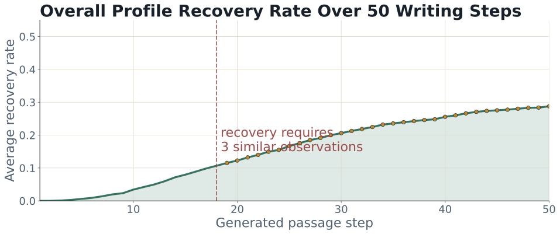

# Writing Helper: An Interruption-Aware AI Writing Assistant

Project C (Design): profile-based AI writing helper.

## Abstract

Writing Helper is a profile-based AI writing assistant that learns from the moment a writer stops the machine. Instead of treating interruption as a failure, the prototype treats it as feedback: when the user stops a generated sentence, chooses a rewrite, or writes a custom repair, the system infers a possible writing preference and stores it in a local profile. The project matters because many AI writing tools produce fluent text that still feels wrong for a particular writer. This prototype asks whether ordinary revision behavior can become a more transparent and less prompt-heavy way to personalize AI writing support.

## AI Disclosure


This work was created with an even blend of human and AI contributions. AI was used to make stylistic edits, such as changes to structure, wording, and clarity. AI was used to make content edits, such as changes to scope, information, and ideas. AI was prompted for its contributions, or AI assistance was enabled. AI-generated content was reviewed and approved. The following model(s) or application(s) were used: Chatgpt 5.4.

I chose a direct disclosure approach for both the report and the project because the prototype itself is about making AI assistance inspectable. A generic sentence like "AI was used" would not fit the values of the system. The disclosure names the kind of contribution AI made, the degree of human review, and the model used. This reveals that the writing, code structure, and reflection were partly shaped through AI assistance. It also obscures some details: it does not show every prompt, every rejected suggestion, or the exact boundary between human decision and AI phrasing. That limitation is important because the project argues for better audit trails, while this disclosure is still a compact label rather than a full process log.

## Motivation

Most AI writing assistants are good at producing coherent prose. The harder problem is producing prose that feels like the writer's intended voice, argument, and level of specificity. A sentence can be grammatical and still be wrong: too broad, too polished, too vague, too cautious, too list-like, or disconnected from the previous idea. In actual writing, people often notice this mismatch at the moment they interrupt, delete, or rewrite.

This project responds to a gap between fluent generation and writer agency. Current assistants often rely on explicit prompting: "make this more concise," "sound more academic," or "use my style." That favors users who already know how to describe their preferences. Writing Helper explores a different signal. It asks whether the system can learn from behavior the writer already performs: stopping the AI when something feels off and selecting a better direction.

The project connects to human-AI writing research such as CoAuthor, which shows that interaction traces are useful evidence in collaborative writing, not just leftover metadata. It also connects to GhostWriter and other preference-learning systems that treat edits and annotations as a way to personalize assistance while preserving user control. My design borrows that general insight but narrows the focus to interruption: the stop point becomes a small but meaningful expression of taste, judgment, and frustration.

## Intended Users and Use Contexts

The intended users are students, researchers, and reflective writers who use AI for drafting but do not want to hand over their voice. The prototype is especially aimed at writers who can recognize when a sentence feels wrong but may not immediately know how to explain the preference behind that feeling.

Typical use contexts include drafting course essays, research-style paragraphs, reflective writing, memos, and project reports. The system is not designed as a one-click essay generator. It is designed as a slower, more inspectable writing partner: the user starts a draft, interrupts at bad moments, compares replacement options, optionally writes a custom repair, and watches a local writing profile form over time.

## Prototype

Run the prototype locally:

```bash
python writing.py
```

The app starts a local web UI at:

```text
http://127.0.0.1:8765
```

The current interface includes:

- user and task input
- a live generated document
- stop, accept, continue, and export controls
- replacement options after interruption
- a custom revision box
- interpreter output explaining the likely reason for the stop
- profile memory showing local observations and durable preferences
- an activity log and timing status

Main implementation files:

- `writing_helper/web.py`: local web server and API
- `writing_helper/web_static/`: browser UI
- `writing_helper/orchestrator.py`: workflow coordination
- `writing_helper/agents.py`: writer, interpreter, replacement, and memory agents
- `writing_helper/simulation.py`: fake-profile recovery simulation
- `writing_helper/storage.py`: local profile persistence

## Design Rationale

The core design decision is to make interruption the central interaction. I could have built a normal chat-based writing helper where the user asks for revisions after a full draft appears. I chose interruption instead because the stop moment is high-signal: it marks the exact sentence where the user's expectation and the AI's output diverged.

The second major decision is to use a profile, not only immediate rewrites. A local rewrite solves the sentence in front of the user, but it does not help the assistant remember the writer. The profile turns repeated choices into durable preferences, such as "avoid generic academic filler" or "explain the mechanism behind important claims." This matters because personalization should be inspectable. The user can see the memory rather than trusting hidden adaptation.

The third decision is to separate local observations from global profile items. In an earlier version, every selected revision was immediately treated as a lasting preference. That was too reactive. The current design requires repeated evidence before promoting a preference. This protects the profile from one-off choices and makes the system less likely to overfit a single sentence.

I vibe-coded much of the prototype, but I still made the main design choices intentionally:

- The interface uses a large live document pane because the writer's text should remain the center of attention.
- Replacement options are placed beside the draft so revision feels like part of writing, not a separate chat.
- The interpreter is visible because the system should explain what it thinks the interruption means.
- Profile memory is visible because personalization should be something the user can inspect.
- Export exists because a writing system that learns from behavior should also let the user review the session data.
- The color and layout are restrained because this is a working writing tool, not a marketing page.

Alternatives I considered:

- A chat-only assistant: easier to build, but it hides the exact moment where a sentence failed.
- A full-document revision tool: useful for polishing, but weaker for learning local preferences.
- Immediate permanent profile updates: simple, but ethically risky because the system could misremember a temporary choice as a stable identity.
- Fully automatic personalization: convenient, but less transparent and harder for the user to correct.

## Process and Iterations

### Iteration 1: From Simple Rewrite Tool to Interruption Signal

The first version treated interruption mostly as a trigger for replacement. The user could stop generation, and the system would offer a small set of rewrite options. This proved useful, but shallow. It helped repair a sentence without explaining what the repair revealed about the writer.

The surprise was that the most interesting data was not the replacement itself but the relation between the stopped sentence and the selected replacement. For example, if the AI wrote a broad sentence and the user chose "make more specific," the system could infer a preference for concrete wording. That changed the project from a rewrite tool into a profile-recovery experiment.

Before:

```text
User stops generation -> replacement options appear -> selected replacement is inserted.
```

After:

```text
User stops generation -> interpreter diagnoses the stop -> replacement options appear -> selected repair becomes evidence for a local profile.
```

### Iteration 2: From Immediate Memory to Repeated Evidence

The second version wrote selected preferences directly into the global profile. This felt satisfying because the profile changed quickly, but it created a problem: one interruption could become a permanent statement about the writer. That is not how writing preferences work. A writer may want more detail in one paragraph and less detail in another.

I changed the memory design so the system stores local observations first. A preference is promoted only after repeated evidence. In the current simulation, the threshold is `3` similar observations. This makes the profile slower but more credible.

Failure case:

```text
One selected option: "Use a more cautious qualifier."
Old behavior: save as a permanent preference.
Problem: the writer may only need caution for this one claim.
New behavior: store as local evidence until it repeats.
```

### Iteration 3: From Hand-Wavy Evaluation to Fake-Profile Simulation

The third pivot was evaluation. At first, I could demonstrate the interface but could not clearly say whether the system recovered anything meaningful. To test the mechanism, I added fake-profile simulation. The simulator creates hidden user profiles, generates writing tasks, interrupts when generated prose violates the hidden profile, chooses from replacement options or writes custom feedback, and measures how many hidden preferences are recovered.

The latest available run was offline because `OPENAI_API_KEY` was not set. It used `100` samples, style-only hidden profiles, and `30` generated passage steps per sample. This is not a real model-based evaluation, but it checks whether the recovery and reporting pipeline works.

Summary from the offline simulation:

| Metric | Mean | Median | Min | Max |
| --- | ---: | ---: | ---: | ---: |
| Target profile items | `10.47` | `10.00` | `9` | `12` |
| Recovered profile items | `5.00` | `5.00` | `1` | `9` |
| Final recall | `0.489` | `0.495` | `0.096` | `0.923` |



One representative hidden profile included preferences such as:

- Avoid generic academic filler.
- Make each sentence connect more explicitly to the prior idea and task.
- Use cautious qualifiers only when they clarify uncertainty, not as padding.
- Open paragraphs with a debatable claim rather than a broad topic sentence.
- Explain the mechanism or reasoning behind important claims.

In the demonstrated run, repeated interruptions eventually promoted six recovered profile items. The recovery curve was slow at first because the threshold prevented immediate promotion, then increased once repeated evidence accumulated.

## Ethical Implications

This project is ethically interesting because it turns ordinary writing behavior into data about a person. That is both the opportunity and the risk. On the positive side, the profile can reduce prompting labor and give writers more control over AI assistance. On the negative side, a system could overinterpret small actions, preserve preferences the user no longer endorses, or make the writer feel watched while drafting.

The current prototype responds to those risks in several ways. Profiles are local, visible, and based on repeated observations rather than single actions. The interpreter output is shown so the user can see how the system is reasoning. Export makes the session reviewable. Still, the prototype does not yet include enough controls for editing, deleting, or rejecting inferred preferences. A more complete version should let users approve profile promotions, mark an inference as wrong, and separate preferences by genre or assignment.

There is also an authorship concern. A tool that learns a user's style can support agency, but it can also smooth away productive struggle. I do not think the goal should be to make every sentence sound instantly polished. The better goal is to help writers notice their own preferences more clearly.

## Reflection and Limitations

I learned that "personalization" is too vague unless the system can show what it thinks it has learned. The profile view became more important than I expected because it changes the assistant from a mysterious generator into a negotiable writing partner. I also learned that interruption is a richer design object than I first assumed. A stop is not just a command; it can be a complaint, a preference, a diagnosis, or a request for a different direction.

I also learned something about my own writing and design process. Because I vibe-coded the prototype, I sometimes moved faster than my explanations. Writing this report forced me to justify decisions that initially came from intuition: why the profile is visible, why promotion should be delayed, why the live document stays central, and why the system should not silently personalize.

The main limitation is that the strongest evaluation is simulated. The offline simulation demonstrates the mechanism, but it does not prove that real writers interrupt in stable enough patterns for accurate profile recovery. The prototype also depends on the quality of the interpreter. If the interpreter misreads the user's reason for stopping, the profile can drift. Another limitation is that the current profile treats preferences as fairly general, while real writing preferences are contextual: a lab report, reflective essay, and policy memo may require different voices.

With another month, I would add user controls for approving, editing, and deleting inferred profile items. I would also run a small user study where participants draft with the tool, then judge whether the recovered profile actually describes them. Finally, I would improve the UI so each profile item links back to the concrete interruptions that produced it.

## Run Instructions

Install dependencies:

```bash
pip install -U "autogen-agentchat" "autogen-ext[openai]" openai
```

Set the API key:

```powershell
$env:OPENAI_API_KEY="your_key_here"
```

Start the app:

```bash
python writing.py
```

Choose a different port:

```bash
python -m writing_helper.web --port 8766
```

Run the real AI simulation:

```bash
python run_fake_profile_simulation.py --count 100 --max-steps 30
```

Run the offline sanity simulation:

```bash
python run_fake_profile_simulation.py --count 100 --max-steps 30 --offline
```

Export a compact audit:

```bash
python export_simulation_report.py simulation_outputs/your_run.json
```

## References

Lee, M., Liang, P., & Yang, Q. (2022). *CoAuthor: Designing a human-AI collaborative writing dataset for exploring language model capabilities*. arXiv. https://arxiv.org/abs/2201.06796

Yeh, C., Ramos, G., Ng, R., Huntington, M., & Banks, R. (2024). *GhostWriter: Augmenting collaborative human-AI writing experiences through personalization and agency*. arXiv. https://arxiv.org/abs/2402.08855

Chen, V., et al. (2024). *Aligning LLM agents by learning latent preference from user edits*. arXiv. https://arxiv.org/abs/2404.15269

PAIR. (n.d.). *People + AI Guidebook*. Google. https://pair.withgoogle.com/guidebook/
