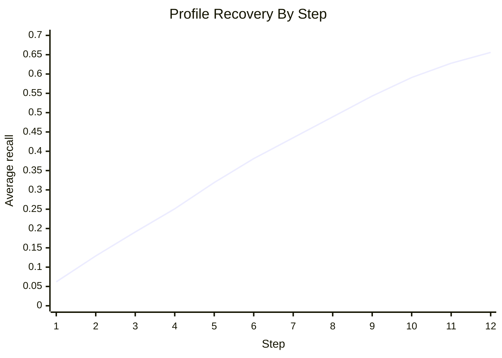
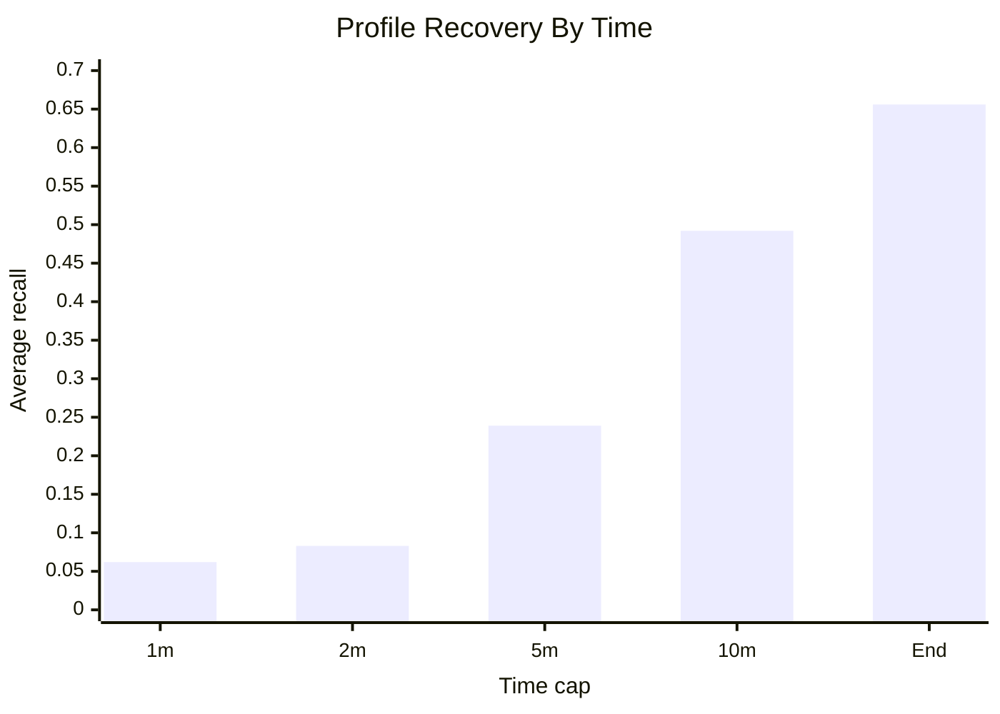

# Writing Helper

Local browser prototype for interruption-aware AI writing. The app streams a draft, lets the user stop when the current sentence feels wrong, proposes local rewrites, and stores recurring writing preferences in a local profile.

## Current App

- `python writing.py` starts the web UI at `http://127.0.0.1:8765`.
- The UI includes user/task input, live document, replacement options, custom revision input, profile memory, logs, and timing status.
- The old Tkinter UI still exists in `writing_helper/ui.py`, but the default app now uses `writing_helper/web.py` and `writing_helper/web_static/`.
- Streaming response time was improved by removing the artificial `0.2s` per-token delay.

## Core Flow

1. Enter a user name and writing task.
2. Start streaming.
3. Stop when the generated text goes off track.
4. The interpreter diagnoses why the sentence may be wrong.
5. The replacement agent proposes rewrite options.
6. Applying a rewrite updates the text and local preference memory.
7. Repeated or explicit durable preferences are saved into the user profile.

## Simulation Report

The code includes fake-profile recovery simulation in `writing_helper/simulation.py`. The real AI path asks a profile-satisfaction simulator to interrupt only when the latest generation misses, contradicts, or ignores the hidden user profile.

The latest available run here was offline because `OPENAI_API_KEY` was not set. It used `100` samples, complex hidden profiles averaging `11.44` items, and `12` generated steps per sample. In this offline run, interruption was not fixed: each generated chunk was assessed against the next hidden preference, and the simulator interrupted only when the chunk missed an unrecovered preference.

### Summary Table

| Metric | Value |
| --- | ---: |
| Samples | `100` |
| Total generated steps | `1200` |
| Interruptions | `749` |
| Non-interruptions | `451` |
| Mean interruptions per user | `7.49` |
| Target profile size, mean | `11.44` items |
| Recovered profile size, mean | `7.49` items |
| Final recall, mean / median | `0.656 / 0.653` |
| Final recall, P10 / P90 | `0.500 / 0.817` |
| Final recall, min / max | `0.383 / 0.916` |
| Final precision, mean / median | `1.000 / 1.000` |
| Selected option actions | `587` |
| Manual describe actions | `162` |

### Recovery By Step

| Step | Interruptions | Average recall | Plot |
| ---: | ---: | ---: | --- |
| 1 | 72 | `0.062` | `██` |
| 2 | 74 | `0.129` | `████` |
| 3 | 72 | `0.191` | `██████` |
| 4 | 66 | `0.251` | `████████` |
| 5 | 79 | `0.319` | `██████████` |
| 6 | 68 | `0.381` | `████████████` |
| 7 | 64 | `0.435` | `██████████████` |
| 8 | 61 | `0.489` | `████████████████` |
| 9 | 60 | `0.543` | `██████████████████` |
| 10 | 55 | `0.591` | `███████████████████` |
| 11 | 43 | `0.628` | `████████████████████` |
| 12 | 35 | `0.656` | `█████████████████████` |



### Recovery By Time

| Time cap | Samples observed | Average recall | Median recall |
| --- | ---: | ---: | ---: |
| 1 min | 33 | `0.062` | `0.080` |
| 2 min | 100 | `0.083` | `0.080` |
| 5 min | 100 | `0.239` | `0.239` |
| 10 min | 100 | `0.492` | `0.492` |
| End of 12 steps | 100 | `0.656` | `0.653` |



### Example Profile And Process

Example user: `fake_user_001`.

Partial hidden profile:

- Open paragraphs with a debatable claim rather than a broad topic sentence.
- Make each sentence connect more explicitly to the prior idea and task.
- Avoid overusing `important` and replace it with the exact reason something matters.
- For bioethics, prefer examples that name a concrete case, actor, or mechanism before generalizing.
- Use more specific wording instead of broad or generic phrasing.
- Avoid generic academic filler such as `in today's society` or `throughout history`.

Example process:

| Step | Time | Simulator decision | Why | Interpreter record | Recall |
| ---: | ---: | --- | --- | --- | ---: |
| 1 | `104.5s` | No interruption | Chunk followed the expected preference or the preference was already recovered. | No interpreter call. | `0.000` |
| 2 | `184.3s` | No interruption | Chunk followed the expected preference or the preference was already recovered. | No interpreter call. | `0.000` |
| 3 | `278.0s` | Interrupt | Chunk missed the hidden preference: avoid overusing `important`; name the exact reason something matters. | The interrupted sentence was under-specified relative to that hidden preference. | `0.101` |
| 4 | `323.1s` | No interruption | Chunk followed the expected preference or the preference was already recovered. | No interpreter call. | `0.101` |
| 5 | `406.7s` | Interrupt | Chunk missed the hidden preference: use more specific wording instead of broad phrasing. | The interrupted sentence was under-specified relative to that hidden preference. | `0.185` |
| 6 | `472.7s` | Interrupt | Chunk missed the hidden preference: avoid generic academic filler. | The interrupted sentence was under-specified relative to that hidden preference. | `0.286` |

When an interruption happens, the system records the stop point, simulator rationale, interpreter reason, selected repair, memory scope, and recovery score in the raw simulation JSON. The compact exporter keeps those fields in `interruption_audit.jsonl`.

This offline run checks the recovery/reporting pipeline. It is not a real AI evaluation. Run the non-offline simulation with an API key for model-based results.

## Run

Install dependencies:

```bash
pip install -U "autogen-agentchat" "autogen-ext[openai]" openai
```

Set the API key:

```powershell
$env:OPENAI_API_KEY="your_key_here"
```

Start the app:

```bash
python writing.py
```

Choose a different port:

```bash
python -m writing_helper.web --port 8766
```

## Simulation

Real AI simulation:

```bash
python run_fake_profile_simulation.py --count 100 --max-steps 12
```

Offline sanity simulation:

```bash
python run_fake_profile_simulation.py --count 100 --max-steps 12 --offline
```

Compact audit export:

```bash
python export_simulation_report.py simulation_outputs/your_run.json
```

The exporter now writes only `interruption_audit.jsonl` and `simulation_summary.json`; the human-readable summary belongs in this README.

## Main Files

- `writing_helper/web.py`: local web server and API.
- `writing_helper/web_static/`: browser UI.
- `writing_helper/orchestrator.py`: workflow coordination.
- `writing_helper/agents.py`: writer, interpreter, replacement, and memory agents.
- `writing_helper/simulation.py`: fake-profile recovery simulation.
- `writing_helper/storage.py`: local profile persistence.
