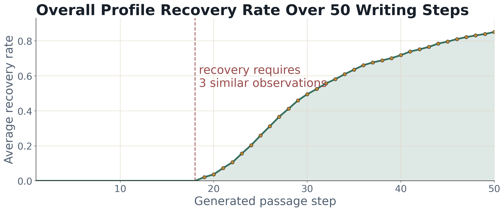
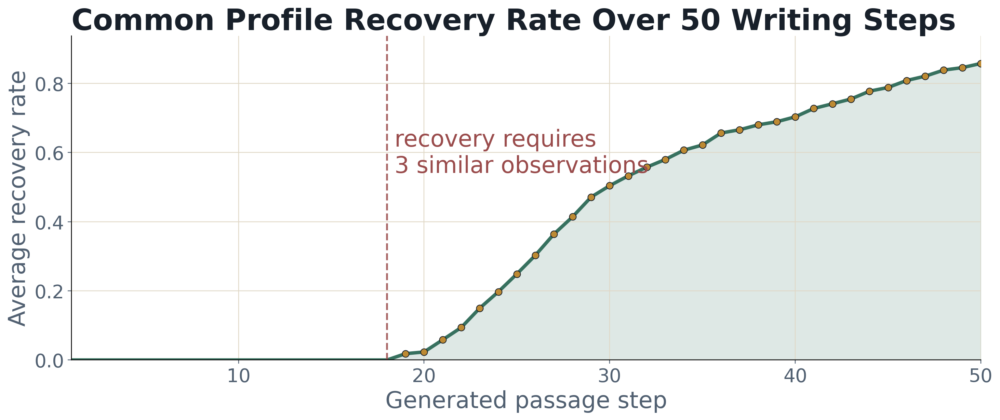
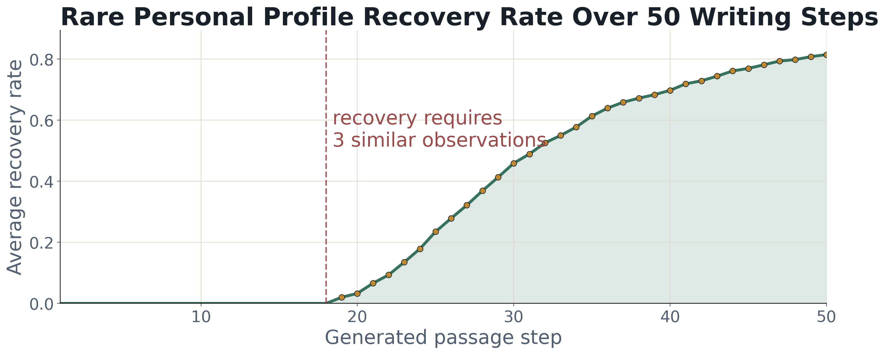
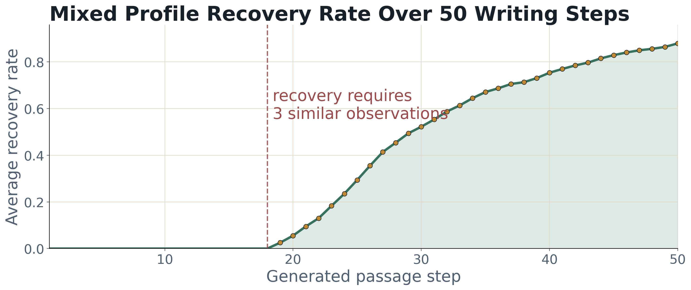

# Writing Helper: An Interruption-Aware AI Writing Assistant

Project C (Design): profile-based AI writing helper.

## Abstract

Writing Helper is a profile-based AI writing assistant that learns from the moment a writer stops the machine. Instead of treating interruption as a failure, the prototype treats it as feedback: when the user stops a generated sentence, chooses a rewrite, or writes a custom repair, the system infers a possible writing preference and stores it in a local profile. The project matters because many AI writing tools produce fluent text that still feels wrong for a particular writer. This prototype asks whether ordinary revision behavior can become a more transparent and less prompt-heavy way to personalize AI writing support.

## AI Disclosure


I designed the whole system and communicated with Professor Lee about the design. AI was used only for coding support and revision of code. AI-generated code or code edits were reviewed and approved. The following model(s) or application(s) were used: Chatgpt 5.4.

I chose a direct disclosure approach for both the report and the project. A generic sentence like "AI was used" would not fit the values of the system. The disclosure names the kind of contribution AI made, the degree of human review, and the model used. I designed the project concept and system logic myself, with feedback from Professor Lee, while using AI as a coding and code-revision assistant. I use vibe coding in this assignment so the limitation is this disclosure is still a compact label rather than a full process log.

## Motivation

Most AI writing assistants are good at producing coherent prose. The harder problem is producing prose that feels like the writer's intended voice, argument, and level of specificity. A sentence can be grammatical and still be wrong because the user doens't like it. In other words, a good writing assitant shall understand users' preference. 

This project responds to a gap between fluent generation and writer agency. Current assistants often rely on explicit prompting: "make this more concise," "sound more academic," or "use my style." That favors users who already know how to describe their preferences. Writing Helper explores a different signal. It asks whether the system can learn from behavior the writer already performs: stopping the AI when something feels off and selecting a better direction.

The project connects to human-AI writing research such as CoAuthor, which shows that interaction traces are useful evidence in collaborative writing, not just leftover metadata. It also connects to GhostWriter and other preference-learning systems that treat edits and annotations as a way to personalize assistance while preserving user control. My design borrows that general insight but narrows the focus to interruption: the stop point becomes a small but meaningful expression of taste, judgment, and frustration.

## Intended Users and Use Contexts

The intended users are students, researchers, and reflective writers who use AI for drafting but do not want to hand over their voice. The prototype is especially aimed at writers who can recognize when a sentence feels wrong but may not immediately know how to explain the preference behind that feeling.

Typical use contexts include drafting course essays, research-style paragraphs, reflective writing, memos, and project reports. The system is not designed as a one-click essay generator. It is designed as a slower, more inspectable writing partner: the user starts a draft, interrupts at bad moments, compares replacement options, optionally writes a custom repair, and watches a local writing profile form over time.

## Prototype

Run the prototype locally:

```bash
python writing.py
```

The app starts a local web UI at:

```text
http://127.0.0.1:8765
```

GitHub repository: https://github.com/Jerry241410/CMSC-FINAL.git

The current interface includes:

- user and task input
- a live generated document
- stop, accept, continue, and export controls
- replacement options after interruption
- a custom revision box
- interpreter output explaining the likely reason for the stop
- profile memory showing local observations and durable preferences
- an activity log and timing status

Main implementation files:

- `writing_helper/web.py`: local web server and API
- `writing_helper/web_static/`: browser UI
- `writing_helper/orchestrator.py`: workflow coordination
- `writing_helper/agents.py`: writer, interpreter, replacement, and memory agents
- `writing_helper/simulation.py`: fake-profile recovery simulation
- `writing_helper/storage.py`: local profile persistence

The multi-agent system uses AutoGen Core to coordinate the writer, interpreter, replacement, and memory agents.

## Design Rationale

I chose interruption instead because the stop moment is high-signal: it marks the exact sentence where the user's expectation and the AI's output diverged.

The second major decision is to use a profile, not only immediate rewrites. A local rewrite solves the sentence in front of the user, but it does not help the assistant remember the writer. The profile turns repeated choices into durable preferences, such as "explain the mechanism behind important claims." This matters because personalization should be inspectable. The user can see the memory.

The third decision is to separate local observations from global profile items. In an earlier version, every selected revision was immediately treated as a lasting preference. That was too reactive. The current design requires repeated evidence before promoting a preference. This protects the profile from one-off choices and makes the system less likely to overfit a single sentence.

I vibe-coded the prototype, but I designed the full system structure and workflow myself and discussed the design with Professor Lee. The project is organized as a multi-agent writing system rather than a single chatbot. The writer agent produces draft text, the user interrupts at the sentence that feels wrong, the interpreter agent analyzes the stop point, the replacement agent generates possible repairs, and the memory layer records repeated preferences in a local profile. The web interface, profile storage, orchestration code, and simulation pipeline are all built around that sequence.

My main design choices were about how the whole system should work:

- The system begins from interruption because the exact stop point gives more useful evidence than a general request like "make this better."
- The agents are separated by role because writing, interpreting a problem, proposing revisions, and updating memory are different tasks that need different prompts and outputs.
- The profile has local and global memory because one selected rewrite should not immediately become a permanent claim about the writer.
- The interface keeps the draft, replacement choices, interpreter output, and profile memory visible because each part represents one stage of the system's reasoning loop.


Alternatives I considered:

- A pre-written profile setup, where the user describes their preferred style before writing. I did not choose this as the main design because writers often discover what they want only after seeing a sentence that feels wrong.
- A single-agent system, where one model handles writing, diagnosis, revision, and memory. I chose a multi-agent structure because each stage has a different job and should be easier to inspect.
- Immediate permanent profile updates after every selected rewrite. This would make the profile grow quickly, but it could misread a temporary choice as a stable writing preference.


## Process and Iterations

### Iteration 1: From Simple Rewrite Tool to Interruption Signal

The first version treated interruption mostly as a trigger for replacement. The user could stop generation, and the system would offer a small set of rewrite options. This proved useful, but shallow. It helped repair a sentence without explaining what the repair revealed about the writer.


Before:

```text
User stops generation -> replacement options appear -> selected replacement is inserted.
```

After:

```text
User stops generation -> interpreter diagnoses the stop -> replacement options appear -> selected repair becomes evidence for profile.
```

### Iteration 2: From Immediate Memory to Repeated Evidence

The second version wrote selected preferences directly into the global profile. This felt satisfying because the profile changed quickly, but it created a problem: one interruption could become a permanent statement about the writer. That is not how writing preferences work. A writer may want more detail in one paragraph and less detail in another.

I changed the memory design so the system stores local observations first. A preference is promoted only after repeated evidence. In the current simulation, the threshold is `3` similar observations. This makes the profile slower but more credible.

Failure case:

```text
One selected option implies: "Use a more cautious qualifier."
Old behavior: save as a permanent preference.
Problem: the writer may only need caution for this one claim.
New behavior: store as local evidence until it repeats.
```

### Iteration 3: Fake-Profile Simulation

The third pivot was evaluation. At first, I could demonstrate the interface but could not clearly say whether the system recovered anything meaningful. To test the mechanism, I added fake-profile simulation. The simulator creates hidden user profiles, generates writing tasks, interrupts when generated prose violates the hidden profile, chooses from replacement options or writes custom feedback, and measures how many hidden preferences are recovered.

The latest available run was offline because `OPENAI_API_KEY` was not set. It used `100` samples, style-only hidden profiles, and `30` generated passage steps per sample. This is not a real model-based evaluation, but it checks whether the recovery and reporting pipeline works.

Summary from the offline simulation:

| Metric | Mean | Median | Min | Max |
| --- | ---: | ---: | ---: | ---: |
| Target profile items | `10.47` | `10.00` | `9` | `12` |
| Target profile words | `102.32` | `102.50` | `79` | `125` |
| Unique words per profile | `78.22` | `78.00` | `63` | `92` |
| Duplicate word count | `24.10` | `23.00` | `9` | `41` |
| Duplicate word ratio | `0.233` | `0.228` | `0.108` | `0.333` |
| Recovered profile items | `5.00` | `5.00` | `1` | `9` |
| Final recall | `0.489` | `0.495` | `0.104` | `0.907` |

Across the `100` simulated writers and `30` steps, the run produced `2486` interruptions. The simulator selected a provided option `1974` times and used manual/custom feedback `512` times. Memory updates were local observations `1986` times and global profile promotions `500` times.

Most frequent words across randomly generated profiles: `the` 458, `and` 247, `avoid` 230, `with` 228, `a` 222, `to` 217, `use` 208, `more` 186, `prefer` 178, `keep` 174, `or` 170, `when` 163.

Most common exact profile items:

| Exact profile item | Profiles containing it |
| --- | ---: |
| Keep wording flexible enough to avoid sounding overly narrow too early. | `51%` |
| Use a brief opposing idea or contrast when it strengthens the point. | `43%` |
| Use more specific wording instead of broad or generic phrasing. | `41%` |
| Prefer clearer, lighter, and more concise sentences. | `41%` |
| Avoid repetition and let each sentence make a fresh move. | `40%` |
| Keep the tone aligned with the intended voice of the piece. | `39%` |
| State the core claim more precisely and with a more refined point. | `35%` |
| Make each sentence connect more explicitly to the prior idea and task. | `34%` |
| Explain the mechanism or reasoning behind important claims. | `34%` |
| Support abstract points with concrete examples when needed. | `33%` |
| Avoid generic academic filler. | `29%` |



Current full 50-step evaluation:

The updated evaluation now tests `50` writing steps instead of `30`. It keeps the original actual writing-case simulation, but compares three profile groups: `common`, `rare`, and `mix`. Each group contains `50` simulated profiles instead of the older `100` single-group setup, and each hidden profile still contains `9` to `12` preferences. The rare personal group samples from `20` less common elements such as comma-separated sentence rhythm, emotionally touched wording, metaphor use, warmer treatment of vulnerable people, punctuation-driven rhythm, compact metaphor, and concrete-scene-to-abstract-claim movement. The mixed group selects exactly `3` rare elements plus `6` to `9` common profile elements.

| Group | Profiles | Steps each | Final average recall | Interruptions | Manual/custom actions |
| --- | ---: | ---: | ---: | ---: | ---: |
| Common profile group | `50` | `50` | `0.857` | `1477` | `297` |
| Rare personal group | `50` | `50` | `0.815` | `1465` | `364` |
| Mixed group | `50` | `50` | `0.879` | `1472` | `355` |

Group recovery plots:







Across all `150` simulated profiles, final average recall was `0.851` after `50` steps, with `4414` interruptions and `1016` manual/custom actions. This was the full offline evaluation run, not the smoke test. The exported report is in `simulation_outputs/profile_group_50x50_offline/simulation_report.md`; it includes exact stopping times and sample traces where the text before the stop is normal text and the replacement is marked with `<mark>...</mark>` for yellow highlighting in Markdown/HTML viewers. In those samples, the `Repair or simulator decision` field uses the interpreter's interpretation rather than only the simulator's selected replacement text.

One representative hidden profile included preferences such as:

- Make each sentence connect more explicitly to the prior idea and task.
- Use cautious qualifiers only when they clarify uncertainty, not as padding.
- Open paragraphs with a debatable claim rather than a broad topic sentence.
- Explain the mechanism or reasoning behind important claims.

In the demonstrated run, repeated interruptions eventually promoted six recovered profile items. The recovery curve was slow at first because the threshold prevented immediate promotion, then increased once repeated evidence accumulated.

### Example Process Trace

Example user: `fake_user_001`.

Task: `Draft a research-style essay on the major debates in bioethics, with attention to mechanism, counterargument, and evidence.`

Full hidden profile being simulated:

- Avoid generic academic filler.
- Favor conceptual synthesis over listing disconnected claims.
- Make each sentence connect more explicitly to the prior idea and task.
- Use cautious qualifiers only when they clarify uncertainty, not as padding.
- Open paragraphs with a debatable claim rather than a broad topic sentence.
- Avoid vague intensifiers and let the sentence's logic carry emphasis.
- Use more specific wording instead of broad or generic phrasing.
- Keep wording flexible enough to avoid sounding overly narrow too early.
- Explain the mechanism or reasoning behind important claims.
- Keep sentence rhythm varied: short claim, longer explanation, concise implication.

The trace below shows the full 30-step process from `docs/poster_simulation.json`. Steps 16, 17, 22, 26, and 28 did not trigger interruption because the simulated user judged the passage acceptable. Other steps created local evidence, and steps 21, 23, 24, 25, 29, and 30 promoted repeated observations into the recovered profile.

| Step | Interrupted | Generated bioethics passage | Repair or simulator decision | Memory state | Recall |
| ---: | :---: | --- | --- | --- | ---: |
| 1 | Yes | Bioethics is a broad field that deals with medicine, technology, public health, and social values. Many issues in the field are important because they affect patients, professionals, and society. The main point is that new medical capacities create many complicated questions that require careful discussion. | Revise the passage so it follows this writing preference: Avoid generic academic filler. | Local observation only. | `0.000` |
| 2 | Yes | Patient autonomy is one of the major debates in bioethics. Patients often want control over their own bodies, while doctors have training that helps them decide what treatment is best. This creates a difficult situation because both sides have important concerns. | Revise the passage so it follows this writing preference: Favor conceptual synthesis over listing disconnected claims. | Local observation only. | `0.000` |
| 3 | Yes | Informed consent is also significant because it helps patients understand medical decisions. It involves information, understanding, and voluntary choice, but the process can be difficult in real clinical settings. For this reason, informed consent remains a central topic in medical ethics. | Revise the passage so each sentence connects more explicitly to the prior idea and task. | Local observation only. | `0.000` |
| 4 | Yes | End-of-life care is another important debate. Some people believe patients should be able to choose death when suffering is severe, while others worry that this changes the role of medicine. Both sides raise serious concerns about dignity, safety, and professional responsibility. | Revise the passage so it follows this writing preference: Use cautious qualifiers only when they clarify uncertainty, not as padding. | Local observation only. | `0.000` |
| 5 | Yes | Assisted dying is controversial because it involves patient choice and the possibility of abuse. Supporters point to autonomy and compassion, while critics point to pressure on vulnerable patients. The debate shows that bioethics must balance individual preference with social protection. | Revise the passage so the paragraph opens with a debatable claim rather than a broad topic sentence. | Local observation only. | `0.000` |
| 6 | Yes | Reproductive ethics includes abortion, embryo selection, surrogacy, and genetic testing. These issues are complicated because they involve bodies, families, future children, and social values. Different people disagree because they begin from different moral assumptions. | Avoid vague intensifiers and let the sentence's logic carry emphasis. | Local observation only. | `0.000` |
| 7 | Yes | Prenatal testing and embryo selection can reduce suffering, but they can also raise concerns about disability and social expectations. Some people think selection is a responsible form of prevention, while others think it can express a narrow view of valuable life. This is a difficult debate with many implications. | Revise the passage with more specific wording and a clearer claim. | Local observation only. | `0.000` |
| 8 | Yes | Bioethics also considers scarce resources, including organs, vaccines, and intensive-care beds. Allocation decisions are hard because they require fairness, effectiveness, and public trust. The issue is especially important when demand is greater than supply. | Revise the passage so it follows this writing preference: Keep wording flexible enough to avoid sounding overly narrow too early. | Local observation only. | `0.000` |
| 9 | Yes | Genetic editing creates another debate because it may prevent disease but may also change future generations. The technology is powerful, and society must decide how to use it responsibly. This shows why bioethics has to keep up with scientific change. | Revise the passage so it explains the mechanism or reasoning behind the claim. | Local observation only. | `0.000` |
| 10 | Yes | Medical artificial intelligence raises questions about accuracy, bias, and responsibility. Algorithms may help clinicians, but they may also reproduce unequal data patterns. This makes oversight and accountability important. | Keep sentence rhythm varied: short claim, longer explanation, concise implication. | Local observation only. | `0.000` |
| 11 | Yes | Public health ethics often requires balancing individual freedom with collective safety. Vaccination, quarantine, and disease surveillance all show this tension. The challenge is deciding when public benefit justifies limits on personal choice. | Revise the passage so it follows this writing preference: Avoid generic academic filler. | Local observation only. | `0.000` |
| 12 | Yes | Overall, bioethics studies difficult questions about medicine and society. Its debates are important because they shape how people live, suffer, choose, and receive care. A good essay should consider different views and evidence. | Revise the passage so it follows this writing preference: Favor conceptual synthesis over listing disconnected claims. | Local observation only. | `0.000` |
| 13 | Yes | Bioethics is a broad field that deals with medicine, technology, public health, and social values. Many issues in the field are important because they affect patients, professionals, and society. The main point is that new medical capacities create many complicated questions that require careful discussion. | Revise the passage so each sentence connects more explicitly to the prior idea and task. | Local observation only. | `0.000` |
| 14 | Yes | Patient autonomy is one of the major debates in bioethics. Patients often want control over their own bodies, while doctors have training that helps them decide what treatment is best. This creates a difficult situation because both sides have important concerns. | Revise the passage so it follows this writing preference: Use cautious qualifiers only when they clarify uncertainty, not as padding. | Local observation only. | `0.000` |
| 15 | Yes | Informed consent is also significant because it helps patients understand medical decisions. It involves information, understanding, and voluntary choice, but the process can be difficult in real clinical settings. For this reason, informed consent remains a central topic in medical ethics. | Revise the passage so it follows this writing preference: Open paragraphs with a debatable claim rather than a broad topic sentence. | Local observation only. | `0.000` |
| 16 | No | End-of-life care turns on the difference between preserving life and prolonging suffering. Ventilators, feeding tubes, and sedation can sustain biological function after recovery or consciousness has become unlikely. The ethical question is whether medicine serves the patient by extending time, or fails the patient by extending a condition the patient has judged intolerable. | Passage accepted by simulator. | No new evidence. | `0.000` |
| 17 | No | The strongest objection to assisted dying is not simply that death is bad. It is that choice can be shaped by disability stigma, family burden, unequal care, or cost pressure. That counterargument forces supporters to show why safeguards, reporting, and independent review can protect autonomy rather than merely assume it. | Passage accepted by simulator. | No new evidence. | `0.000` |
| 18 | Yes | Reproductive ethics includes abortion, embryo selection, surrogacy, and genetic testing. These issues are complicated because they involve bodies, families, future children, and social values. Different people disagree because they begin from different moral assumptions. | Keep wording flexible enough to avoid sounding overly narrow too early. | Local observation only. | `0.000` |
| 19 | Yes | Prenatal testing and embryo selection can reduce suffering, but they can also raise concerns about disability and social expectations. Some people think selection is a responsible form of prevention, while others think it can express a narrow view of valuable life. This is a difficult debate with many implications. | Revise the passage so it follows this writing preference: Explain the mechanism or reasoning behind important claims. | Local observation only. | `0.000` |
| 20 | Yes | Bioethics also considers scarce resources, including organs, vaccines, and intensive-care beds. Allocation decisions are hard because they require fairness, effectiveness, and public trust. The issue is especially important when demand is greater than supply. | Revise the passage so it follows this writing preference: Keep sentence rhythm varied: short claim, longer explanation, concise implication. | Local observation only. | `0.000` |
| 21 | Yes | Genetic editing creates another debate because it may prevent disease but may also change future generations. The technology is powerful, and society must decide how to use it responsibly. This shows why bioethics has to keep up with scientific change. | Avoid generic academic filler. | Promoted: Avoid generic academic filler. | `0.042` |
| 22 | No | Medical AI shifts ethical attention from individual judgment to system design. A model may improve diagnosis while embedding bias from the data used to train it. Responsibility therefore cannot stop with the clinician using the tool; it also belongs to the institutions that validate, monitor, and deploy it. | Passage accepted by simulator. | No new evidence. | `0.042` |
| 23 | Yes | Public health ethics often requires balancing individual freedom with collective safety. Vaccination, quarantine, and disease surveillance all show this tension. The challenge is deciding when public benefit justifies limits on personal choice. | Revise the passage so each sentence connects more explicitly to the prior idea and task. | Promoted: Make each sentence connect more explicitly to the prior idea and task. | `0.168` |
| 24 | Yes | Overall, bioethics studies difficult questions about medicine and society. Its debates are important because they shape how people live, suffer, choose, and receive care. A good essay should consider different views and evidence. | Use cautious qualifiers only when they clarify uncertainty, not as padding. | Promoted: Use cautious qualifiers only when they clarify uncertainty, not as padding. | `0.284` |
| 25 | Yes | Bioethics is a broad field that deals with medicine, technology, public health, and social values. Many issues in the field are important because they affect patients, professionals, and society. The main point is that new medical capacities create many complicated questions that require careful discussion. | Revise the passage so the paragraph opens with a debatable claim rather than a broad topic sentence. | Promoted: Open paragraphs with a debatable claim rather than a broad topic sentence. | `0.411` |
| 26 | No | The autonomy debate is not a contest between patient preference and medical expertise alone. Its mechanism is institutional: because clinicians control specialized knowledge, patients can be reduced to objects of judgment unless consent procedures return agency to them. Shared decision-making is stronger than pure autonomy or pure paternalism because it lets clinicians define medically reasonable options while patients decide which risks fit their values. | Passage accepted by simulator. | No new evidence. | `0.411` |
| 27 | Yes | Informed consent is also significant because it helps patients understand medical decisions. It involves information, understanding, and voluntary choice, but the process can be difficult in real clinical settings. For this reason, informed consent remains a central topic in medical ethics. | Revise the passage with more specific wording and a clearer claim. | Local observation only. | `0.411` |
| 28 | No | End-of-life care turns on the difference between preserving life and prolonging suffering. Ventilators, feeding tubes, and sedation can sustain biological function after recovery or consciousness has become unlikely. The ethical question is whether medicine serves the patient by extending time, or fails the patient by extending a condition the patient has judged intolerable. | Passage accepted by simulator. | No new evidence. | `0.411` |
| 29 | Yes | Assisted dying is controversial because it involves patient choice and the possibility of abuse. Supporters point to autonomy and compassion, while critics point to pressure on vulnerable patients. The debate shows that bioethics must balance individual preference with social protection. | Revise the passage so it explains the mechanism or reasoning behind the claim. | Promoted: Explain the mechanism or reasoning behind important claims. | `0.495` |
| 30 | Yes | Reproductive ethics includes abortion, embryo selection, surrogacy, and genetic testing. These issues are complicated because they involve bodies, families, future children, and social values. Different people disagree because they begin from different moral assumptions. | Revise the passage so it follows this writing preference: Keep sentence rhythm varied: short claim, longer explanation, concise implication. | Promoted: Keep sentence rhythm varied: short claim, longer explanation, concise implication. | `0.600` |

Recovered helper profile for this example:

1. Avoid generic academic filler.
2. Make each sentence connect more explicitly to the prior idea and task.
3. Use cautious qualifiers only when they clarify uncertainty, not as padding.
4. Open paragraphs with a debatable claim rather than a broad topic sentence.
5. Explain the mechanism or reasoning behind important claims.
6. Keep sentence rhythm varied: short claim, longer explanation, concise implication.

## Ethical Implications

The main ethical issue is that the writing profile is built from behavioral data. An interruption may look small, but it can reveal information about a user's writing habits, confidence, style, academic needs, or even the kinds of arguments they struggle with. If this profile were stored insecurely, shared without consent, or used outside the writing context, it could become a privacy problem.

The second issue is overinterpretation. The system might treat one local revision as evidence of a stable preference, even when the user only wanted that change for one sentence or one assignment. This is why the prototype separates local observations from global profile memory and requires repeated evidence before promoting a preference. Still, this does not fully solve the problem. A more complete version should let users approve, edit, delete, or reject inferred profile items, and it should make clear which interruptions produced each profile claim.


## Reflection and Limitations

I learned that "personalization" is too vague unless the system can show what it thinks it has learned. The profile view became more important than I expected because it changes the assistant from a mysterious generator into a negotiable writing partner. I also learned that interruption is a richer design object than I first assumed. A stop is not just a command; it can be a complaint, a preference, a diagnosis, or a request for a different direction.

I also learned something about my own writing and design process. Because I vibe-coded the prototype, I sometimes moved faster than my explanations. Writing this report forced me to justify decisions that initially came from intuition: why the profile is visible, why promotion should be delayed, why the live document stays central, and why the system should not silently personalize.

The main limitation is that the strongest evaluation is simulated. The offline simulation demonstrates the mechanism, but it does not prove that real writers interrupt in stable enough patterns for accurate profile recovery. The prototype also depends on the quality of the interpreter. If the interpreter misreads the user's reason for stopping, the profile can drift. Another limitation is that the current profile treats preferences as fairly general, while real writing preferences are contextual: a lab report, reflective essay, and policy memo may require different voices.

In the future, I would add user controls for approving, editing, and deleting inferred profile items. I would also run a small user study where participants draft with the tool, then judge whether the recovered profile actually describes them. Finally, I would improve the UI so each profile item links back to the concrete interruptions that produced it.

## Run Instructions

Install dependencies:

```bash
pip install -U "autogen-agentchat" "autogen-ext[openai]" openai
```

Set the API key:

```powershell
$env:OPENAI_API_KEY="your_key_here"
```

Start the app:

```bash
python writing.py
```

Choose a different port:

```bash
python -m writing_helper.web --port 8766
```

Run the real AI simulation:

```bash
python run_fake_profile_simulation.py --count 50 --max-steps 50 --profile-group all
```

Run the full offline evaluation without an API key:

```bash
python run_fake_profile_simulation.py --count 50 --max-steps 50 --profile-group all --offline
```

Export a compact audit:

```bash
python export_simulation_report.py simulation_outputs/your_run.json
```

## References

Lee, M., Liang, P., & Yang, Q. (2022). *CoAuthor: Designing a human-AI collaborative writing dataset for exploring language model capabilities*. arXiv. https://arxiv.org/abs/2201.06796

Yeh, C., Ramos, G., Ng, R., Huntington, M., & Banks, R. (2024). *GhostWriter: Augmenting collaborative human-AI writing experiences through personalization and agency*. arXiv. https://arxiv.org/abs/2402.08855

Chen, V., et al. (2024). *Aligning LLM agents by learning latent preference from user edits*. arXiv. https://arxiv.org/abs/2404.15269

PAIR. (n.d.). *People + AI Guidebook*. Google. https://pair.withgoogle.com/guidebook/
